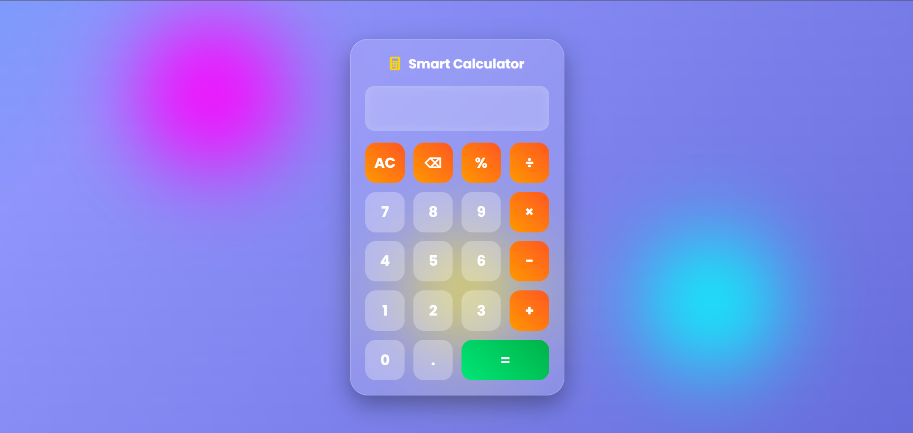
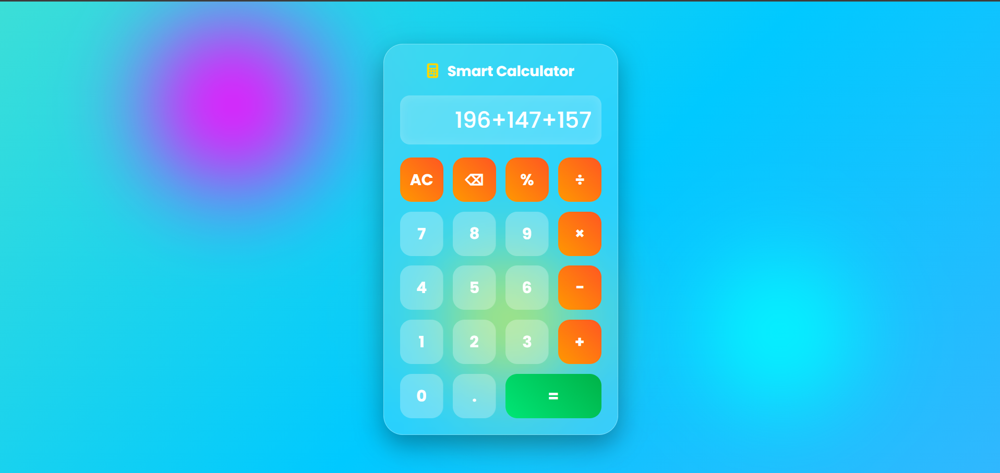
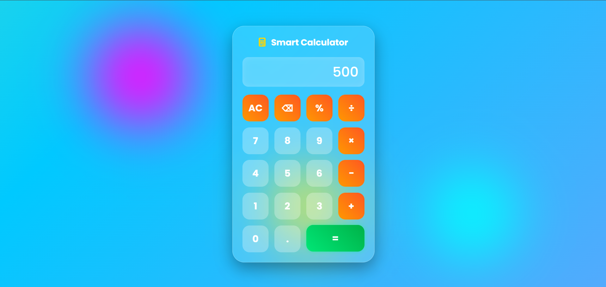

# 🧮 Smart Glass Calculator

A modern and responsive calculator built using **HTML**, **CSS**, and **JavaScript**. It features a beautiful Glassmorphism design, animated background, glowing buttons, and supports all basic mathematical operations.

---

## ✨ Features

- ➕ Addition, Subtraction, Multiplication & Division
- 📊 Percentage & Decimal Support
- ⌨️ Keyboard Support
- 🗑️ Clear (AC) & Backspace Buttons
- 🎨 Glassmorphism UI
- 🌈 Animated Gradient Background
- 💡 Glowing Hover Effects
- 📱 Fully Responsive Design

---

## 🛠️ Technologies Used

- HTML5
- CSS3
- JavaScript (ES6)

```

---

## 🚀 How to Run

1. Download or clone the repository.
2. Open the project folder.
3. Run `index.html` in your browser or use **Live Server** in VS Code.

---

## 📸 Screenshots

### 🏠 Home Screen



### 🧮 Calculator in Action



### 📱 Mobile View



---

## 🚀 Future Improvements

- 🌙 Dark Mode
- 🧮 Scientific Calculator
- 📜 Calculation History
- 🎙️ Voice Input
- 🔊 Sound Effects

---

## 👨‍💻 Author

**Sumit Kumar Prusty**  
B.Tech Computer Science & Engineering

---

## 📄 License

This project is licensed under the **MIT License**.

⭐ If you like this project, don't forget to **Star** the repository!
